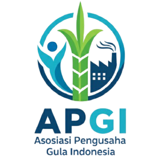

# 🌾 APGI - Asosiasi Pengusaha Gula Indonesia

<p align="center">
  
</p>

<p align="center">
  <strong>Mengembangkan Stabilitas Perdagangan Gula Nasional Menuju Swasembada Pangan</strong>
</p>

<p align="center">
  
  
  
  
</p>

## 📋 Tentang APGI

Website resmi **Asosiasi Pengusaha Gula Indonesia (APGI)** yang menyediakan informasi terkini dan sumber daya berguna untuk kemajuan industri gula Indonesia. Platform ini dibangun untuk memfasilitasi komunikasi antara stakeholder industri gula dan mendukung pencapaian swasembada gula nasional.

## ✨ Fitur Utama

- 🏠 **Hero Section** - Landing page yang clean dan informatif
- ℹ️ **About Section** - Informasi lengkap tentang APGI
- 👥 **Member Section** - Showcase anggota perusahaan dengan logo interaktif
- 🏢 **Struktur Organisasi** - Hierarki kepengurusan APGI
- 📅 **Kegiatan Terkini** - Update aktivitas dan program berjalan
- 🎯 **Program Unggulan** - Progress tracking program strategis
- 🖼️ **Galeri** - Dokumentasi visual kegiatan APGI
- 📱 **Responsive Design** - Optimal di semua perangkat
- 🔄 **Smooth Navigation** - Single-page application dengan scroll halus

## 🛠️ Teknologi yang Digunakan

### Backend
- **Laravel 11.x** - PHP Framework
- **PHP 8.2+** - Server-side scripting
- **SQLite** - Database

### Frontend
- **Bootstrap 5.3.0** - CSS Framework
- **Font Awesome 6.4.0** - Icon library
- **Google Fonts** - Typography (Inter & Playfair Display)
- **Vanilla JavaScript** - Interactive features

### SEO & Performance
- **SEO Tools** - Meta tags optimization
- **Image optimization** - Logo sebagai image untuk SEO
- **Semantic HTML** - Struktur markup yang proper

## 📸 Website Preview

Website APGI menampilkan informasi lengkap tentang Asosiasi Pengusaha Gula Indonesia dengan design yang modern dan SEO-friendly.

## 🚀 Instalasi & Setup

### Prerequisites
- PHP 8.2 atau lebih tinggi
- Composer
- Node.js & NPM (opsional, untuk asset compilation)

### Langkah Instalasi

1. **Clone repository**
   ```bash
   git clone https://github.com/username/apgi-website.git
   cd apgi-website
   ```

2. **Install dependencies**
   ```bash
   composer install
   ```

3. **Setup environment**
   ```bash
   cp .env.example .env
   php artisan key:generate
   ```

4. **Database setup**
   ```bash
   touch database/database.sqlite
   php artisan migrate --seed
   ```

5. **Start development server**
   ```bash
   php artisan serve
   ```

6. **Akses website**
   ```
   http://localhost:8000
   ```

## 📁 Struktur Project

```
APGI-New/
├── 📱 app/
│   ├── Http/Controllers/     # Controllers
│   └── Models/              # Models
├── 🎨 resources/
│   ├── css/                 # Stylesheets
│   ├── js/                  # JavaScript files
│   └── views/               # Blade templates
│       ├── layouts/         # Layout templates
│       └── home.blade.php   # Main page
├── 🌐 public/
│   └── images/              # Image assets
│       ├── logo-apgi.png    # Main logo
│       ├── hero-main.jpg    # Hero image
│       ├── members/         # Member company logos
│       └── gallery-*.jpg    # Gallery images
├── 🗄️ database/
│   ├── migrations/          # Database migrations
│   └── seeders/            # Data seeders
└── 📝 config/              # Configuration files
```

## 🎨 Customization

### Color Scheme
Website menggunakan palet warna hijau yang merepresentasikan industri pertanian:

```css
--primary-color: #2E7D32;    /* Green primary */
--secondary-color: #4CAF50;   /* Light green */
--accent-color: #81C784;      /* Accent green */
--dark-color: #1B5E20;        /* Dark green */
--light-color: #E8F5E8;       /* Light background */
```

### Typography
- **Headers**: Playfair Display (Serif)
- **Body**: Inter (Sans-serif)

### Logo & Branding
Logo APGI sudah dioptimasi untuk SEO dengan menggunakan format image dan alt text yang proper.

## 📈 SEO Features

- ✅ **Semantic HTML5** markup
- ✅ **Meta descriptions** untuk setiap section
- ✅ **Alt text** pada semua images
- ✅ **Logo sebagai image** (bukan icon) untuk SEO
- ✅ **Structured data** ready
- ✅ **Responsive images** optimization

## 🔧 Development

### Adding New Sections
1. Tambahkan section baru di `resources/views/home.blade.php`
2. Update navigation di `resources/views/layouts/app.blade.php`
3. Tambahkan styling CSS untuk section baru
4. Update JavaScript navigation array

### Menambah Member Baru
1. Upload logo ke `public/images/members/`
2. Edit member section di `home.blade.php`
3. Update array `allMembers` dalam function `showAllMembers()` 
4. Ikuti format card yang sudah ada dengan alt text yang sesuai

### Update Member Photos
**Member photos harus:**
- Format: PNG dengan background transparan
- Ukuran: Minimum 200x200px, maksimum 400x400px
- Optimasi untuk web (ukuran file < 50KB)
- Nama file: `member-X.png` (X = nomor urut 1-8)
- Alt text: Nama perusahaan lengkap untuk SEO

### Daftar Lengkap 43 Anggota APGI:
```
1. CV Hasil Karya Wijaya                21. CV Manunggal Jaya Abadi
2. PT. Putra Benteng Sejahtera         22. PT Inti Kurnia Trading  
3. CV Sumber Kencana Abadi             23. PT Pamer
4. PT Mitra Agro Utama                 24. CV Puncak Raya
5. PT Fajar Mulia Transindo            25. PT Tiga Bintang Cemerlang
6. CV Agro Prima Santoso               26. CV Rukun Makmur
7. CV Anugrah Bersama Cemerlang        27. CV Tiga Berlian
8. PT Berkah Sarana Irjatama           28. CV Inti Gula Manias
9. CV Kasih Karunianya                 29. CV Agro Tani Sejahtera
10. PT Mitra Pangan Nusantara          30. PT Nusantara Agro Mandiri
11. CV Citra Mulia Abadi               31. PT Setia Mandiri Sentra Makmur
12. CV Swasembada                      32. PT Mandiri Berlian Perkasa
13. PT Agung Samudra Mulia             33. PT Berlian Penta Sukses
14. CV Indika Multi Karya              34. CV Sri Rejeki
15. CV Sentosa                         35. PT Energi Muda Nusantara
16. PT Rambi Jaya                      36. PT Cipta Karya Pratama
17. PT Citra Gemini Mulya              37. CV Ardana Sukses Makmur
18. CV Surya Kencana                   38. PT. Berkah Sarana Irjatama
19. PT. Nusantara Putra Mandiri        39. CV Semangat Jaya Makmur
20. PT Wijaya Tama Langgengperkasa     40. PT. Arthajaya Putra Perdana
                                       41. CV Sumber Pangan
                                       42. PT Sumatra Sejahtera  
                                       43. PT Mahakam Lestari Transindo
```

## 🤝 Contributing

Kontribusi sangat diterima! Silakan:

1. Fork repository
2. Buat feature branch (`git checkout -b feature/AmazingFeature`)
3. Commit changes (`git commit -m 'Add some AmazingFeature'`)
4. Push ke branch (`git push origin feature/AmazingFeature`)
5. Buat Pull Request

## 📞 Kontak

**APGI - Asosiasi Pengusaha Gula Indonesia**
- Website: [www.apgi.or.id](http://www.apgi.or.id)
- Email: info@apgi.or.id
- Telepon: +62-21-xxxxxxxx

## 📄 License

Project ini menggunakan [MIT License](LICENSE).

---

<p align="center">
  Made with ❤️ for Indonesian Sugar Industry
</p>
